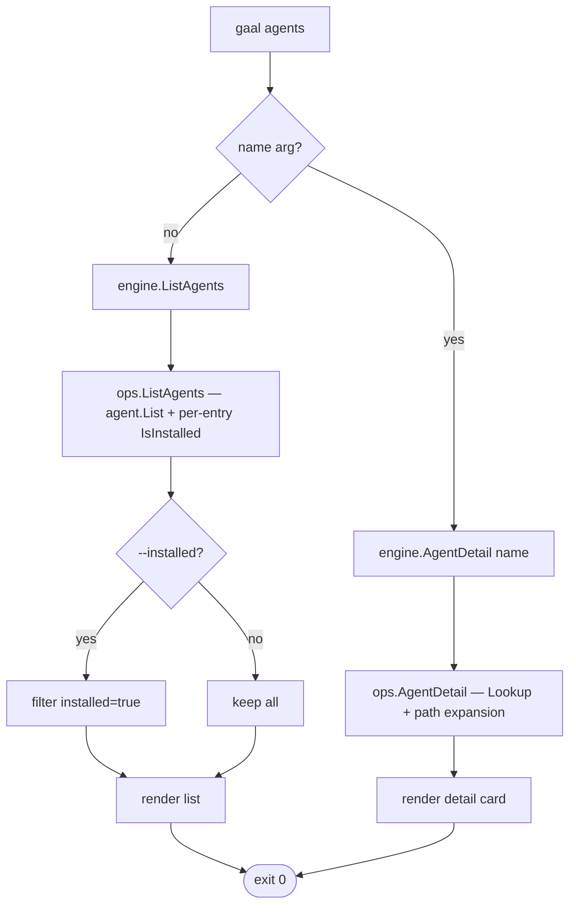

# `gaal agents`

> List registered coding agents and detect installed ones, or show the
> full path layout for a single agent.

## Usage

```
gaal agents                # list every registered agent
gaal agents <name>         # detail card for one agent
gaal agents --installed    # filter list to detected installs only
```

| Flag | Default | Description |
|------|---------|-------------|
| `--installed / -i` | `false` | Show only agents detected as installed on this machine |

## Exit codes

| Code | Meaning |
|------|---------|
| `0` | Rendered |
| `2` | Unknown agent name (when called with `<name>`) |

---

## Flow



## What "installed" means

For each registered agent, `IsInstalled` checks for the agent's
canonical install marker:

| Agent kind | Marker |
|-----------|--------|
| Most agents | Existence of the agent's project skills dir, global skills dir, or MCP config dir |
| `claude-desktop` | App-specific path on macOS / Windows (PR #194 / #128) — never reports installed on Linux |

The detection is **structural** (file/dir existence), not behavioural
(no command execution). False positives are possible if a directory was
created manually; false negatives if the agent stores state in a
non-standard location.

## Registry source

The agent registry is loaded from [`internal/core/agent/agents.yaml`](../../internal/core/agent/agents.yaml)
(embedded at build time) and optionally extended via
`~/.config/gaal/agents.yaml`. See [`docs/core.md`](../core.md) for the
full registry contract and security constraints.

---

## Side effects

Read-only.

## Related

- [`gaal info agent <name>`](info.md) — equivalent to `gaal agents <name>`.
- [`docs/core.md`](../core.md) — agent registry rules.
