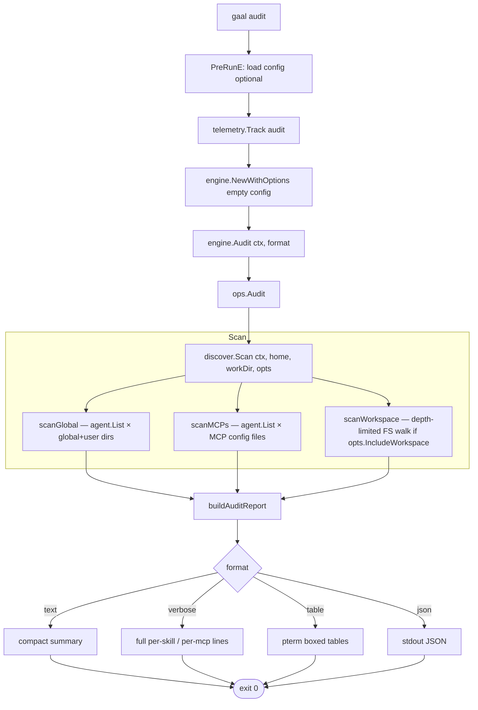

# `gaal audit`

> Discover every skill and MCP server installed on this machine,
> regardless of whether it is declared in `gaal.yaml`.

`audit` is the **config-independent** counterpart to `gaal status`:
where status shows declared resources reconciled with disk, audit shows
**only what is on disk** — useful for spotting skills installed
manually, by another tool, or by a previous `gaal` config that was
since edited.

## Usage

```
gaal audit
```

Inherits global flags only. The `--config` is optional — `audit` works
without any config file present (it sets the engine to an empty
config).

## Exit codes

| Code | Meaning |
|------|---------|
| `0` | Inventory rendered |
| `2` | Discovery scan failed (rare; FS error) |

---

## Flow



## What audit scans

For each registered agent (from
[`internal/core/agent`](../packages/core-agent.md)):

- **Project skills**: `<workDir>/<ProjectSkillsSearch>/...` (1-level deep)
- **Global skills**: `~/<GlobalSkillsSearch>/...` (1-level deep)
- **PM (package manager) skills**: `~/<PmSkillsSearch>/...` (recursive)
- **MCP config**: agent's `ProjectMCPConfigPath` and `GlobalMCPConfigPath`

PR #193 (#137) added `scanMCPs` coverage of both project- and
global-scoped MCP files; PR #194 (#128) added `claude-desktop` install
detection.

## Drift annotation

For every discovered skill, `audit` annotates whether it is **managed**
(declared in the merged config) or **unmanaged**. Detection uses the
same `discover.Scan` snapshot machinery as `status` so the labels are
consistent across the two commands. See
[`docs/packages/discover.md`](../packages/discover.md).

---

## Side effects

Read-only.

## Related

- [`gaal status`](status.md) — config-aware view.
- [`docs/packages/discover.md`](../packages/discover.md) — scan internals.
