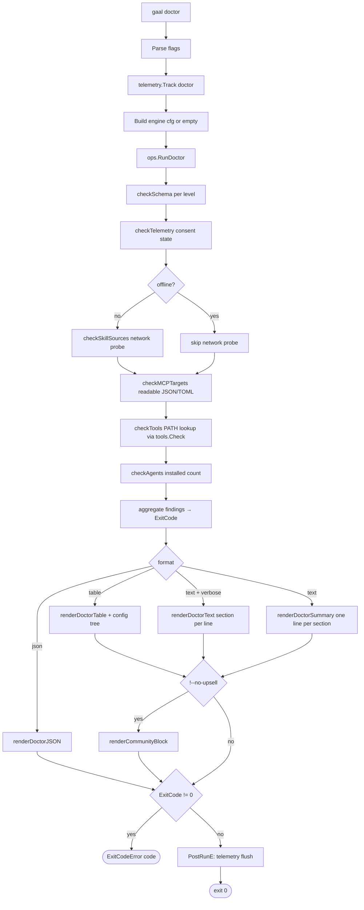

# `gaal doctor`

> Configuration health checks. Verifies that the merged config parses
> against the live schema, that targeted skill sources are reachable,
> that MCP target files are readable, that required external tools are
> on `PATH`, and that the targeted agents exist on this machine.

## Usage

```
gaal doctor [flags]
```

| Flag | Default | Description |
|------|---------|-------------|
| `--offline` | `false` | Skip every network probe (skill source reachability) |
| `--no-upsell` | `false` | Suppress the Community Edition upsell footer |

## Exit codes

| Code | Meaning |
|------|---------|
| `0` | All checks passed |
| `1` | Warnings only (e.g. agents declared in config but not detected) |
| `2` | At least one error (schema mismatch, missing required tool with no fallback, unreadable MCP target) |

---

## Flow



## Checks

| Check | What it does | Failure mode |
|-------|-------------|--------------|
| `checkSchema` | Validates each config level (global / user / workspace) against `Config` struct rules; reports unknown YAML keys (PR #190 / #135) | error |
| `checkTelemetry` | Reports current consent state and where it is stored | informational |
| `checkSkillSources` | HTTP HEAD-like probe via [`internal/httpx`](../packages/httpx.md) for each remote skill source | warning |
| `checkMCPTargets` | Tries to read each resolved MCP target path | error if unreadable; warning if missing |
| `checkTools` | Looks up every tool declared by a config source via [`internal/tools`](../packages/tools.md) on `PATH` | warning |
| `checkAgents` | Counts agents registered vs. detected as installed | warning |

## Hook into the rest of gaal

`doctor` is the only command that surfaces the **same probe** as
`gaal sync`'s `warnMissingTools` banner, but with full attribution
(which source declares the tool) and a non-zero exit code when the
config is unhealthy. Use it in CI to gate a `gaal sync`.

---

## Side effects

Read-only, except for telemetry tracking (consent-gated).

## Related

- [`gaal sync`](sync.md) — `warnMissingTools` banner shares the
  underlying probe.
- [`docs/packages/tools.md`](../packages/tools.md) — how external-tool
  declarations are collected from config.
- [`docs/packages/telemetry.md`](../packages/telemetry.md) — consent
  state checked by `checkTelemetry`.
