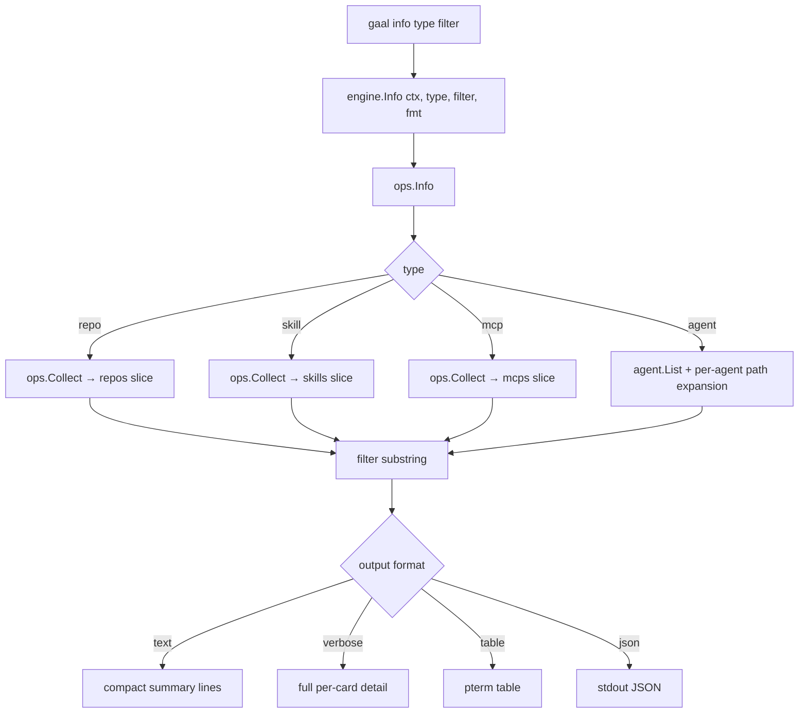

# `gaal info`

> Detailed per-entry card for a single resource type. Read-only.

## Usage

```
gaal info <repo|skill|mcp|agent> [filter]
```

| Argument | Description |
|----------|-------------|
| Resource type | One of `repo`, `skill`, `mcp`, `agent` |
| Filter | Optional case-insensitive substring match against the resource name |

## Exit codes

| Code | Meaning |
|------|---------|
| `0` | Rendered (even if zero matches) |
| `2` | Could not load config or resolve resource |

---

## Flow



`info` reuses the same `ops.Collect` as `gaal status`, then renders a
**deeper** view: instead of the one-line-per-resource summary it emits a
multi-line card per matching entry (paths, version, install targets,
detected drift, source URL — credentials redacted via
[`urlx.Redact`](../packages/urlx.md)).

## Output format honoring `--verbose`

PR #186 (#129) routes `gaal info` through `effectiveOutputFormat()` so
`--verbose` produces the full card in text mode (rather than the
default compact summary). Without `--verbose`:

- `text` → one summary line per match
- `verbose` (or `-v`) → full card per match
- `table` / `json` → unaffected by `--verbose` (always full detail)

---

## Side effects

Read-only: `gaal info` reads the same paths as `gaal status` (config
chain + agent dirs + snapshots). It writes nothing.

## Related

- [`gaal status`](status.md) — summary view of the same data.
- [`gaal agents`](agents.md) — `gaal info agent <name>` is a superset.
