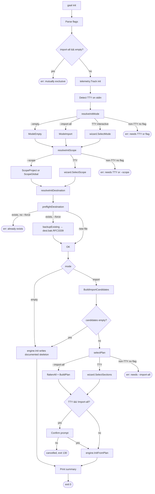

# `gaal init`

> Bootstrap a `gaal.yaml`: empty skeleton, full import of installed
> resources, or interactive wizard.

## Usage

```
gaal init [flags]
```

| Flag | Default | Description |
|------|---------|-------------|
| `--scope` | _(prompt)_ | `project` (writes `gaal.yaml` in CWD) or `global` (writes user config) |
| `--import-all` | `false` | Non-interactive: import every detected skill / MCP |
| `--empty` | `false` | Non-interactive: write the documented skeleton only |
| `--force / -f` | `false` | Allow overwriting an existing destination (a backup is taken first — see [Backup](#backup)) |

`--import-all` and `--empty` are mutually exclusive.

## Exit codes

| Code | Meaning |
|------|---------|
| `0` | File written |
| `1` | Wizard cancelled by user — pterm prints "init cancelled"; treated as a clean cancel via `cmd.ExitCodeError{Code:130}` (PR #188 / #140) |
| `2` | Hard error (FS, permissions, validation) |

---

## Flow



---

## Backup

When `--force` is used and the destination exists, the previous file is
renamed to `<dest>.bak.<UTC-RFC3339>` **before** the new file is
written (PR #198, closes #139). The user always has a recoverable copy
of their old config:

```
gaal.yaml          ← new content
gaal.yaml.bak.2026-05-03T05:14:31Z   ← previous content
```

The backup uses [`secfile.Write`](../packages/secfile.md) so it lands
with `0o600` even if the original was looser.

## Documented skeleton

The "empty" mode is **not** an empty file. `engine.Init` (which
delegates to `internal/config/template`) generates a fully-commented
YAML skeleton from the live struct tags — the comments stay in sync
with the schema automatically. See [`docs/config.md — Template`](../config.md#data-model)
for the field-introspection mechanism.

## Import mode

`BuildImportCandidates(ctx, scope)` runs a config-independent FS scan
(via [`internal/discover`](../packages/discover.md)) for skills + MCP
servers, then `BuildPlan` selects either everything (`--import-all`) or
the user's wizard picks. `engine.InitFromPlan` writes the resulting
YAML using the template renderer so the imported file has the same
structure (and comments) as a freshly-initialised one.

---

## Side effects

| Path | Notes |
|------|-------|
| `gaal.yaml` (or `~/.config/gaal/config.yaml` for `--scope global`) | created via `secfile.Write` 0o600 |
| `<dest>.bak.<timestamp>` | written **before** the destination when `--force` is used |
| Agent skill/MCP dirs | read-only scan during `import` mode |

## Related

- [`docs/config.md`](../config.md) — full reference for the resulting file.
- [`gaal sync`](sync.md) — the natural next step after `gaal init`.
- [`gaal schema`](schema.md) — emit JSON Schema for IDE validation.
