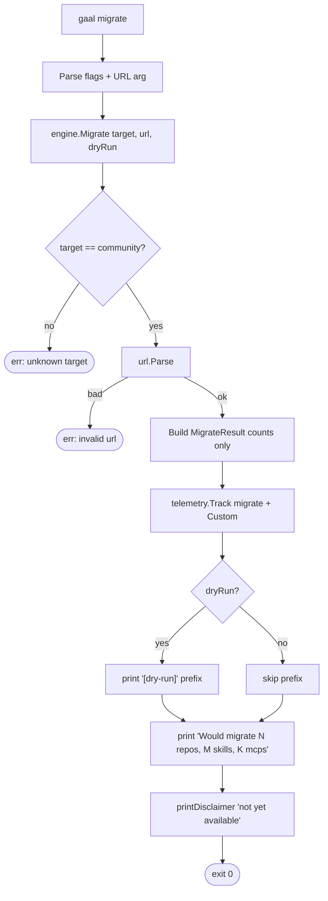

# `gaal migrate`

> Migrate the merged config to a Community Edition instance.
> **Stub** — counts only; no actual transfer happens yet.

## Usage

```
gaal migrate --to community <url> [--dry-run]
```

| Flag | Default | Description |
|------|---------|-------------|
| `--to` | _(required)_ | Migration target. Only `community` is recognised today |
| `--dry-run` | `false` | Print the would-be summary line and exit |

The `--yes` flag was removed in PR #185 (#141) — it was declared but
never used.

## Exit codes

| Code | Meaning |
|------|---------|
| `0` | Plan rendered (this is the only success path until the full migration ships) |
| `2` | Unknown `--to` target, or invalid URL |

---

## Flow



## Why a stub

The CLI surface is intentionally locked in early so `gaal migrate` is
documented and discoverable, even while the implementation is pending.
The first non-stub release will:

- Authenticate with the target Community Edition instance.
- Push declared repos / skills / MCP entries via the instance API.
- Reconcile remote acceptance results back into the user's config.

---

## Side effects

None today.

## Related

- [`gaal init`](init.md) — bootstraps the config that `migrate` would
  push.
