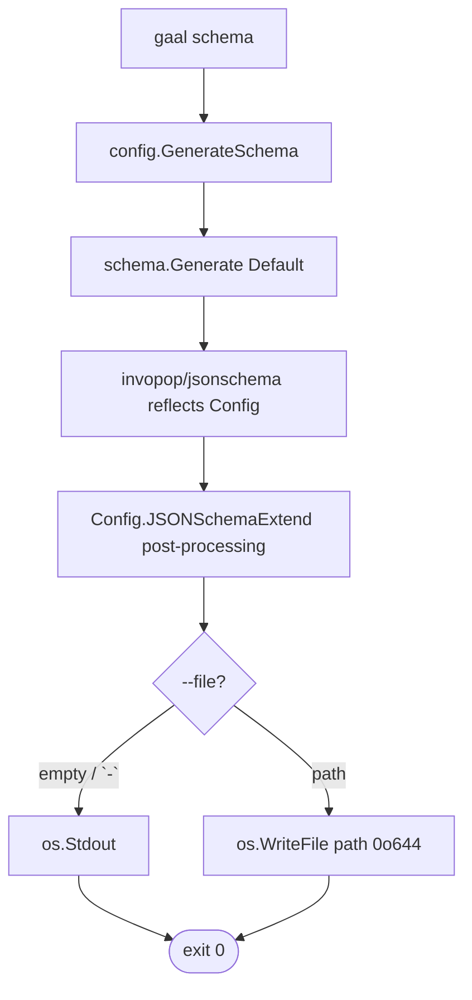

# `gaal schema`

> Emit the JSON Schema (draft 2020-12) for `gaal.yaml`. Used by IDEs
> for live validation and autocompletion.

## Usage

```
gaal schema                      # write to stdout
gaal schema --file schema.json   # write to disk
gaal schema -f -                 # explicit stdout
```

| Flag | Default | Description |
|------|---------|-------------|
| `--file / -f` | `""` | Output path; empty or `-` writes to stdout |

## Exit codes

| Code | Meaning |
|------|---------|
| `0` | Schema rendered |
| `2` | File write failed |

---

## Flow



## Why it stays in sync

The schema is generated from the **runtime** `Config` struct via
`reflect`, so it is always 1-to-1 with the source code. `make build`
re-runs `dist/gaal schema -f dist/schema.json` after compilation to
keep the committed schema fresh.

The active generator is swappable via
`config/schema.Set(g Generator)` — useful for tests or for
experimenting with alternative schema libraries. See
[`docs/config.md — Schema Generation`](../config.md#schema-sub-package-internalconfigschema).

## IDE setup

```yaml
# .vscode/settings.json
{
  "yaml.schemas": {
    "./schema.json": ["gaal.yaml"]
  }
}
```

JetBrains IDEs and Neovim with `yaml-language-server` follow the same
pattern.

---

## Side effects

Reads nothing from the user's config. Writes either stdout or the file
named by `--file`.

## Related

- [`docs/config.md`](../config.md) — schema generation pillar.
