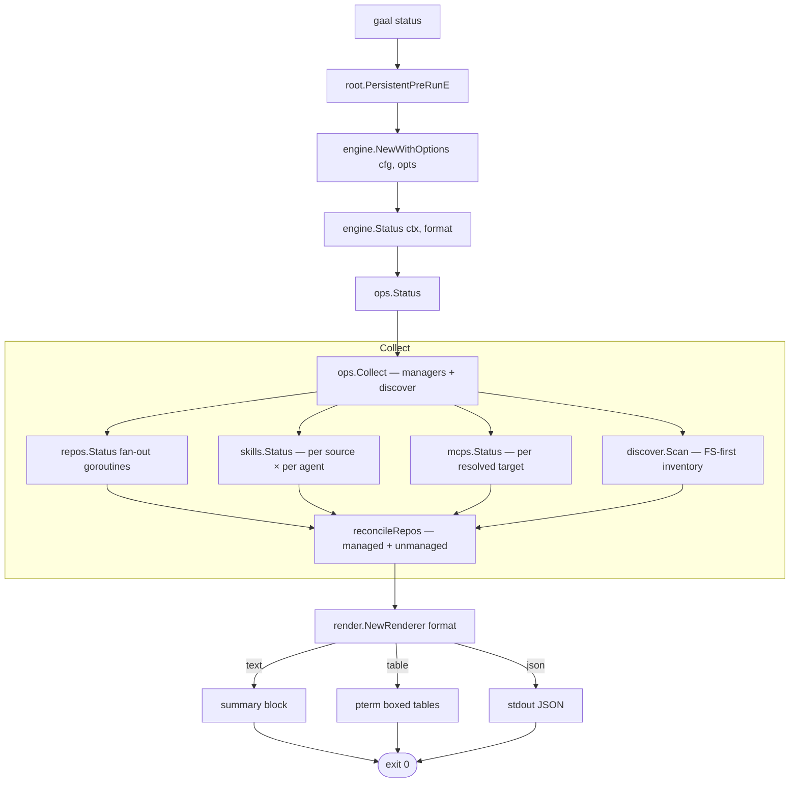
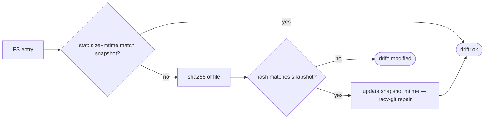

# `gaal status`

> Read-only snapshot of the current resource state on disk versus the
> merged configuration. Never writes.

For the **end-user reading guide** (what each column / icon means in
the rendered output), see [`docs/status.md`](../status.md). This page
covers the **architecture and execution flow**.

---

## Usage

```
gaal status [flags]
```

Inherits global flags only (`--config`, `--output`, `--verbose`,
`--sandbox`, `--no-banner`, `--log-file`).

## Exit codes

| Code | Meaning |
|------|---------|
| `0` | Status collected and rendered (no implicit failure if drift is reported) |
| `2` | Could not collect status (config load error, FS unreadable, etc.) |

`gaal status` is informational — drift alone never sets a non-zero exit.
Use the JSON output (`--output json`) and grep / `jq` for CI checks.

---

## Execution flow



### Collect — the merge layer

`ops.Collect` is the only place where **config-declared** resources
(driven by the three managers) and **FS-discovered** resources (driven
by `internal/discover`) meet. The reconcile rules:

| Source of resource | Treatment |
|--------------------|-----------|
| Declared in `gaal.yaml` and present on disk | Status from manager + drift from snapshot |
| Declared but missing on disk | Status `partial` / `not cloned` |
| Present on disk but not declared | Appended as `unmanaged` (status `?`) |
| Snapshot record but no FS entry | Drift `missing` |

The same `Collect` powers both `gaal status` and the `eng.Collect`
post-sync summary used by `gaal sync` — it is the single source of
truth for "what is the current state?".

---

## Drift detection (Git-index fast path)

Skills, repos and MCP files all use the same heuristic from
[`internal/discover`](../packages/discover.md):



For directories tracked by a VCS, `vcs.HasChanges()` is consulted
**first** — VCS-native detection is faster and authoritative for git /
hg / svn / bzr trees.

---

## Side effects

`gaal status` reads the following:

| Path | Notes |
|------|-------|
| `gaal.yaml` and the merge chain | as resolved by `internal/config` |
| Every declared repo / skill destination | `os.Stat` + selective hashing |
| Every registered agent's skill / MCP directory | for unmanaged scan |
| `~/.cache/gaal/state/*.json` (sandbox-aware) | snapshots written by past `gaal sync` |

It writes **nothing** other than possibly a snapshot mtime touch
(racy-git repair) — and only when the file content already matches the
recorded hash.

---

## Related

- [`gaal sync`](sync.md) — the writer side.
- [`gaal audit`](audit.md) — config-independent inventory.
- [`docs/status.md`](../status.md) — end-user reading guide for the
  rendered output.
- [`docs/packages/discover.md`](../packages/discover.md) — snapshot
  internals.
