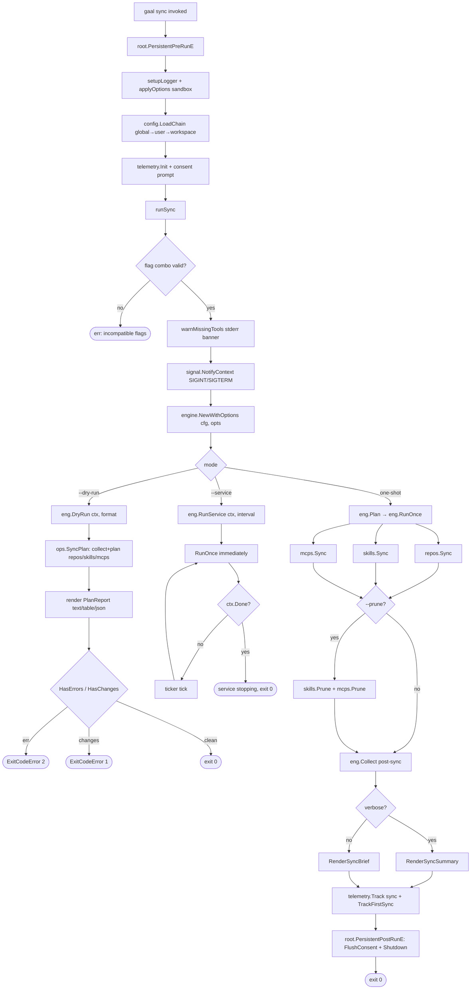
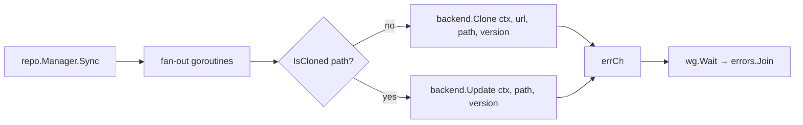
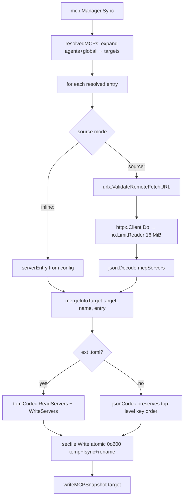
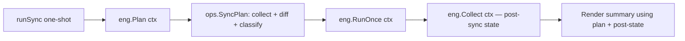
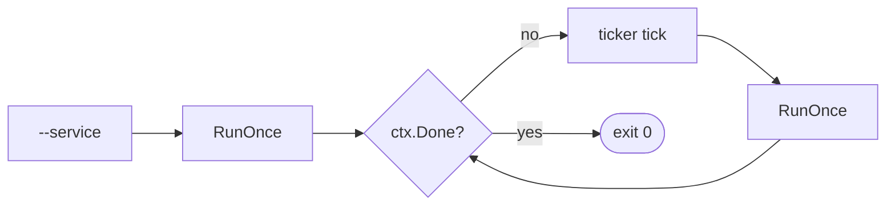

# `gaal sync`

> Clone or update every repository, install every skill into every
> targeted agent, and upsert every MCP server entry into the targeted
> agent JSON / TOML file. One-shot by default; loops on a ticker with
> `--service`.

`sync` is the only command that **writes** to disk and to agent
configuration files. Every other command is read-only or scoped to its
own state directory.

---

## Usage

```
gaal sync [flags]
```

| Flag | Default | Description |
|------|---------|-------------|
| `--service / -s` | `false` | Run continuously at `--interval`, exit on SIGINT/SIGTERM |
| `--interval / -i` | `5m` | Polling interval in service mode |
| `--dry-run` | `false` | Compute the plan and render it; never write |
| `--prune` | `false` | After a one-shot sync, remove on-disk skills and MCP entries that are no longer declared (and gated per entry — see [Prune](#prune)) |
| `--force` | `false` | When `agents: ["*"]`, install into every registered agent — even those without an installed config dir |

`--dry-run` and `--service` are mutually exclusive (a dry-run loop is
meaningless). `--prune` is incompatible with `--service` (destructive
operations stay one-shot).

## Exit codes

| Code | Meaning |
|------|---------|
| `0` | Success — nothing to do, or every change applied without error |
| `1` | `--dry-run` only: there are pending changes (informational) |
| `2` | A managed resource failed (network error, validation, FS error). Surfaces through `cmd.ExitCodeError{Code:2,Cause:err}` so `PersistentPostRunE` still runs (telemetry + consent flush) |
| `130` | SIGINT / SIGTERM during sync — propagated via context cancel |

---

## End-to-end flow



---

## Inside the three managers

`engine.RunOnce` calls each manager's `Sync(ctx)` in order: repositories,
skills, MCPs. Errors from one manager do not abort the others — all three
runs are attempted, and per-manager errors are joined via
`errors.Join` for the final non-zero exit.

### 1 — `repo.Manager.Sync` (parallel goroutines per repo)



- One goroutine per `repositories:` entry.
- Backend selection comes from `vcs.New(cfg.Type)`:
  `git`, `hg`, `svn`, `bzr` (full clones), or `tar` / `zip` (HTTP
  archive fetch + atomic extract).
- For `git`, `IsCloned` validates HEAD via `gogit.PlainOpen` — a
  half-cloned dir reports `false` so the next sync re-clones into a
  staging dir and atomically swaps in (PRs #207 + #204 share the
  staging-then-rename pattern).
- For `tar` / `zip`, see [`packages/core-vcs.md`](../packages/core-vcs.md);
  the per-entry size cap is 256 MiB, the per-archive cap 1 GiB, and
  the entry count cap 50 000.

### 2 — `skill.Manager.Sync` (sequential per source)

```mermaid
flowchart TD
    A[skill.Manager.Sync] --> B[for each ConfigSkill]
    B --> C[resolveSource]
    C --> C1{local path?}
    C1 -- yes --> C1a[expand ~/, return path]
    C1 -- no --> C1b[urlToCacheKey → ~/.cache/gaal/skills/<key>]
    C1b --> C1c{IsCloned?}
    C1c -- no --> C1d[NewShallow git Clone depth=1]
    C1c -- yes --> C1e[NewShallow git Update — hard-reset to origin HEAD]
    C1a --> D
    C1d --> D
    C1e --> D
    D[discoverSkills source] --> E[filterSkills via select:]
    E --> F[resolveAgents — expand `[*]` to detected installed]
    F --> G[for each agent, for each skill]
    G --> H[installSkill src→dst]
    H --> H1[mkdir staging .gaal-skill-tmp-*]
    H1 --> H2[walkDir src → copyFile staging]
    H2 --> H3[RemoveAll dst → Rename staging dst]
    H3 --> I[writeSkillSnapshot dst]
    I --> J[discover.Save SnapshotPath]
```

#### Local skill cache layout

Remote sources are cloned into `os.UserCacheDir()/gaal/skills/<key>/`
where `<key>` is derived from the URL via `urlToCacheKey()`:

| OS | Cache root | Full path |
|----|------------|-----------|
| Linux | `$XDG_CACHE_HOME` or `~/.cache` | `~/.cache/gaal/skills/<key>/` |
| macOS | `~/Library/Caches` | `~/Library/Caches/gaal/skills/<key>/` |
| Windows | `%LocalAppData%` | `%LocalAppData%\gaal\skills\<key>\` |

In `--sandbox` mode `os.UserCacheDir()` is redirected so the cache
resolves inside the sandbox tree.

For `git` sources the cache is a **shallow** clone (`depth=1`) and
updates are hard-resets to `origin/HEAD` — robust against force-pushes
and history rewrites.

#### Atomic install

`installSkill` stages the entire copy into a sibling temp directory
(`.gaal-skill-tmp-*`), then `RemoveAll(dst) + Rename(staging, dst)`.
A crash mid-copy leaves the previous skill untouched (or the new one
fully installed) — never a half-written tree the next sync would treat
as up-to-date. Files removed upstream disappear because `dst` is
replaced wholesale, not overlay-merged.

#### Snapshot writes

After every successful `installSkill`, `writeSkillSnapshot()` records
size + mtime + sha256 for every file under `dst` so the next
`gaal status` can use the Git-index fast path. See
[`packages/discover.md`](../packages/discover.md) for the snapshot
format and lifecycle.

### 3 — `mcp.Manager.Sync` (sequential per entry)



- `resolvedMCPs()` expands `agents:` + `global:` into one concrete
  target file per agent. The `["*"]` wildcard expands to every
  registered agent that has a non-empty MCP config path.
- The target file extension picks the codec:
  - `.toml` → `tomlCodec` (used by Codex)
  - anything else → `jsonCodec` (Claude Code, Claude Desktop, VS Code, Cursor…)
- `jsonCodec` preserves top-level key order and per-key indentation by
  walking the parse tokens directly (PR #203, closes #122).
- Every write goes through `secfile.Write`: temp file beside the
  destination → fsync → atomic rename → chmod 0o600 (PR #202, closes
  #120).

---

## Plan vs. apply

A `--dry-run` runs only the planning phase. The **same planner** runs
ahead of every one-shot apply so the post-sync summary can use
past-tense verbs ("cloned", "installed", "upserted") for each managed
resource:



The plan never writes; the apply does. If `Plan` itself errors, the
sync still proceeds (the planner is best-effort) but the rendered
summary may be less precise.

---

## Cancellation

`runSync` wraps the context with `signal.NotifyContext(SIGINT, SIGTERM)`.
On Ctrl-C:

- All running goroutines (`repo.Manager.Sync` fan-out, in-flight
  HTTP fetches via `httpx.Client`) observe `ctx.Done()` and unwind.
- `cmd/sync.go` calls `checkInterrupted(ctx)` after Plan / RunOnce /
  Prune — early termination produces a clean exit with code 130 (PR
  #200, closes #126).
- `--service` mode cancels the ticker loop and returns `nil`.

---

## Prune

`--prune` removes on-disk skills and MCP entries that are no longer
declared in the merged config. Two safety gates apply:

1. **`--prune` is incompatible with `--service`** — destructive
   operations are explicitly one-shot.
2. **MCP prune requires per-target opt-in** (`prune: true` on at
   least one config entry pointing at that target file). Without the
   opt-in, manually-curated entries on the user's machine are not
   wiped (PR #199, closes #142).

Repositories are **never** pruned automatically — deletion of source
trees requires explicit user action (`rm -rf` on the path).

---

## Service mode

`--service` runs `RunOnce` immediately, then loops on a `time.Ticker`:



A consecutive-failure cap (5) breaks the loop if the same iteration
keeps erroring (PR #201, closes #134) — prevents a wedged config from
silently filling logs forever. Successful iterations reset the counter.

---

## Tooling probe

Before running, `warnMissingTools(cfg)` prints a stderr banner listing
every required external tool that is **not** on `PATH`:

```
⚠ Required tools missing from PATH:
    hg   — required by source vercel-labs/agent-skills (suggest: brew install mercurial)
    svn  — required by repository src/legacy
  Run `gaal doctor` for details.
```

Sync **never blocks** on missing tools — full attribution and exit-code
semantics live in [`gaal doctor`](doctor.md). The probe is purely an
early-warning so the user sees the cause before the per-entry failure
that would otherwise come later. See [`packages/tools.md`](../packages/tools.md).

---

## Side effects (everything sync touches)

| Path | Read / Write | Owner |
|------|-------------|-------|
| `gaal.yaml` (and `~/.config/gaal/config.yaml`, `/etc/gaal/config.yaml`) | read | `internal/config` |
| `repositories.<path>` on disk | clone / update | `internal/repo` + `internal/core/vcs` |
| `~/.cache/gaal/skills/<key>/` (sandbox-aware) | clone / update | `internal/skill` |
| `<workDir>/<agent-skills-dir>/<skill>/` | install (atomic stage+rename) | `internal/skill` |
| `~/.<agent>/skills/<skill>/` (when `global: true`) | install (atomic stage+rename) | `internal/skill` |
| Agent MCP config (e.g. `~/.claude.json`, `~/.codex/config.toml`, `~/.cursor/mcp.json`) | upsert (atomic 0o600 write) | `internal/mcp` |
| `~/.cache/gaal/state/<key>.json` (snapshot index) | write | `internal/discover` |
| `~/.local/state/gaal/telemetry.jsonl` (when consented) | append (0o600) | `internal/telemetry` |

In `--sandbox <dir>` mode, every `~/...` path above is rewritten under
`<dir>/...` via `applyOptions`. Real user state is untouched.

---

## Related

- [`docs/commands/status.md`](status.md) — read-only counterpart used to
  observe the result of a sync.
- [`docs/packages/repo.md`](../packages/repo.md),
  [`docs/packages/skill.md`](../packages/skill.md),
  [`docs/packages/mcp.md`](../packages/mcp.md) — manager internals.
- [`docs/packages/discover.md`](../packages/discover.md) — snapshot
  format and Git-index fast path.
- [`docs/packages/secfile.md`](../packages/secfile.md) — atomic
  write semantics shared across managers.
