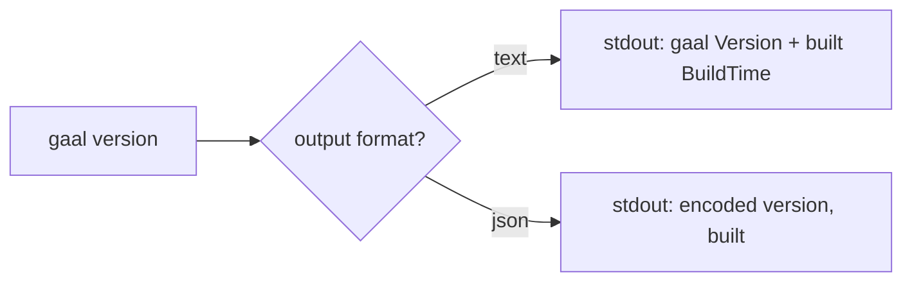

# `gaal version`

> Print the version string and build timestamp.

## Usage

```
gaal version              # text: "gaal X.Y.Z\nbuilt YYYY-MM-DDTHH:MM:SSZ\n"
gaal version --output json
```

## Exit codes

| Code | Meaning |
|------|---------|
| `0` | Always |

---

## Flow



## Where the values come from

`Version` and `BuildTime` are package-level vars in `cmd/version.go`,
optionally injected at build time via `ldflags`:

```
go build -ldflags "
  -X gaal/cmd.Version=$(git describe --tags --always --dirty)
  -X gaal/cmd.BuildTime=$(date -u +%Y-%m-%dT%H:%M:%SZ)
"
```

Without these flags (e.g. `go run .`), values fall back to `"dev"` /
`"unknown"`.

## User-Agent propagation

`cmd/version.go`'s `init()` calls `httpx.SetUserAgent("gaal/" + Version)`
so every outbound HTTP request from
[`internal/httpx`](../packages/httpx.md) carries the version. This
matters for telemetry attribution and for upstream servers that rate-
limit by UA.

---

## Side effects

None.

## Related

- [`docs/packages/httpx.md`](../packages/httpx.md) — UA propagation.
