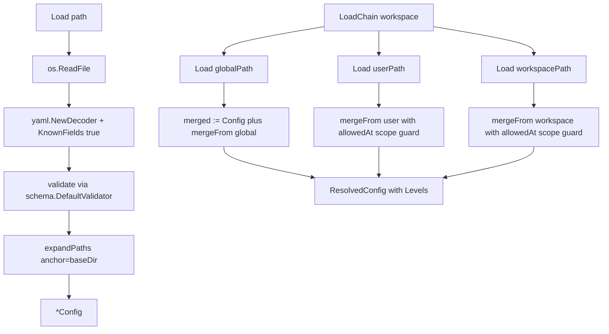

# `internal/config`

> YAML loading, three-level merge chain, scope policy, schema
> generation, validation. The single source of truth for what
> "configured" means in gaal.

> **Pillar reference:** the full pillars description (config / scope
> policy / schema / validation / platform / template) lives in
> [`docs/config.md`](../config.md). This page is the package-level
> summary.

## Public API

| Symbol | Description |
|--------|-------------|
| `Load(path string) (*Config, error)` | Parse + validate + expand a single file |
| `LoadChain(workspacePath string) (*ResolvedConfig, error)` | Merge global → user → workspace |
| `GenerateSchema() ([]byte, error)` | JSON Schema for `Config` |
| `GlobalConfigFilePath() string` | OS-aware system config path |
| `UserConfigFilePath() string` | OS-aware user config path |
| `ConfigScope`, `ScopeGlobal`, `ScopeUser`, `ScopeWorkspace` | Scope type + constants |
| `ParseConfigScope(s string) (ConfigScope, error)` | Parse a scope string |

## Sub-packages

| Sub-package | Page | Role |
|-------------|------|------|
| `internal/config/platform` | (in [`docs/config.md`](../config.md#platform-sub-package-internalconfigplatform)) | OS-specific path resolution |
| `internal/config/schema` | (in [`docs/config.md`](../config.md#schema-sub-package-internalconfigschema)) | Swappable schema generator + validator |
| `internal/config/template` | (in [`docs/config.md`](../config.md#data-model)) | Documented YAML skeleton from struct tags |

## Flow

## Recent fixes worth knowing

| PR | Issue | Effect |
|----|-------|--------|
| #190 | #135 | `yaml.NewDecoder(...).KnownFields(true)` rejects unknown keys |
| #191 | #136 | `expandPaths` warns when two repository keys collide after expansion |
| #192 | #138 | `isGitHubShorthand` validates GitHub identifier syntax (1-39 chars, alphanumerics + `-_.`, no leading/trailing separator) |

## Tests

`internal/config/...` targets **100 % coverage**. Path resolution tests
live in `platform/manager_test.go`; expansion tests in `utils_test.go`;
merge / scope tests in `manager_test.go`.

## Related

- [`docs/config.md`](../config.md) — full pillars description
- [`packages/secfile.md`](secfile.md) — used to write config files
  in `gaal init`
