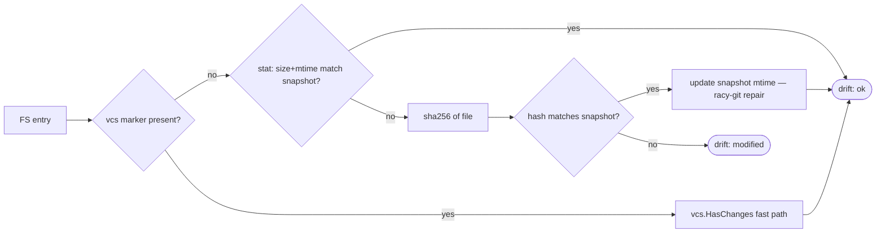
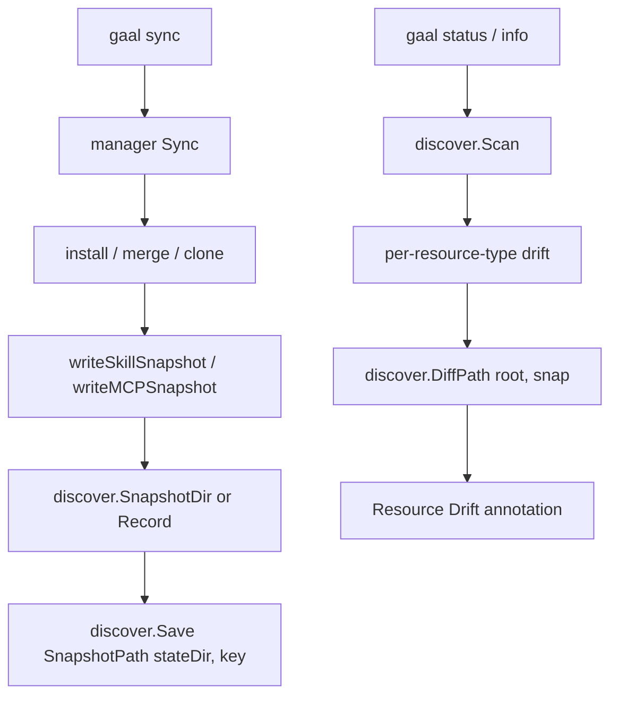

# `internal/discover`

> FS-first resource discovery + Git-inspired snapshot drift detection.

> **Pillar reference:** the full discovery pillar — resource model,
> snapshot lifecycle, scan options, per-resource-type scan logic — lives
> in [`docs/discover.md`](../discover.md). This page is the
> package-level summary.

## Public API

| Symbol | Description |
|--------|-------------|
| `Scan(ctx, home, workDir string, opts ScanOptions) ([]Resource, error)` | Public entry point |
| `ScanOptions` | `MaxDepth`, `IncludeWorkspace`, `StateDir`, `Timeout` |
| `Resource` | `{Type, Scope, Path, Name, Drift, VCSType, Managed, Meta}` |
| `Snapshot` | `map[string]FileRecord` |
| `Load`, `Save`, `Record`, `SnapshotDir`, `DiffPath`, `SnapshotPath`, `WorkdirKey` | Snapshot helpers |
| `ResourceType`, `Scope`, `DriftState` | Enum types and constants |

## Drift heuristic

## Snapshot lifecycle

## State directory

| OS | Default path |
|----|-------------|
| Linux | `~/.cache/gaal/state/` |
| macOS | `~/Library/Caches/gaal/state/` |
| Windows | `%LocalAppData%\gaal\state\` |

Sandbox-aware. Snapshots are keyed by `WorkdirKey(path)` (8-char hex of
`sha256(path)[:4]`) so different installation paths for the same skill
name never collide.

## Per-resource-type scan

| File | Scope |
|------|-------|
| `global.go` | Agent-registry skill dirs (global + user) |
| `mcp.go` | Agent MCP config files (project + global since PR #193) |
| `workspace.go` | Depth-limited FS walk for repos and skills in `workDir` |

## Recent fixes worth knowing

| PR | Issue | Effect |
|----|-------|--------|
| #193 | #137 | `scanMCPs` now scans both `ProjectMCPConfigPath` and `GlobalMCPConfigPath` |

## Related

- [`docs/discover.md`](../discover.md) — full pillar description
- [`commands/status.md`](../commands/status.md), [`commands/audit.md`](../commands/audit.md) — main consumers
- [`packages/secfile.md`](secfile.md) — atomic snapshot writes
