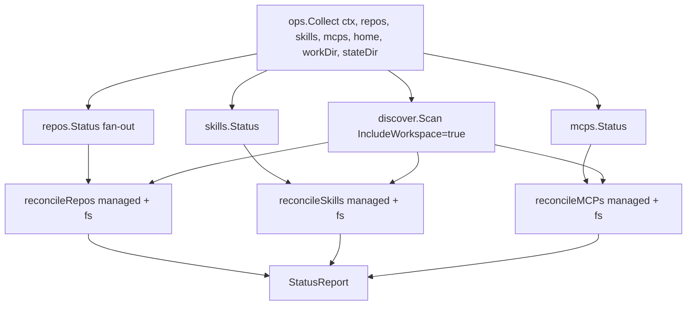
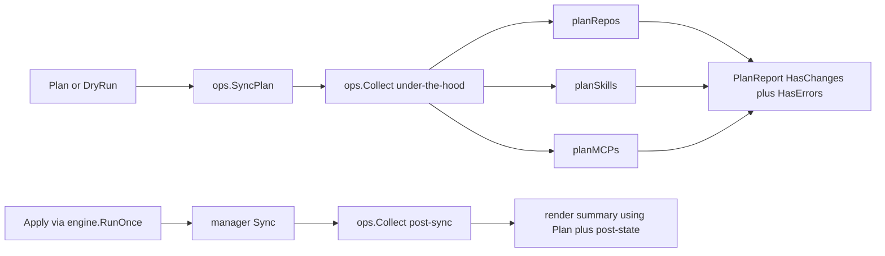

# `internal/engine/ops`

> Stateless functions that implement each CLI command. Each function
> receives the managers and config it needs as parameters — no global
> state, no init magic.

## File layout

| File | Exported symbols | Description |
|------|-----------------|-------------|
| `status.go` | `Collect()`, `Status()` | FS-first state via `discover.Scan`; reconciles config-declared and FS-discovered resources |
| `plan.go` | `SyncPlan()`, `RenderPlan()` | Compute the sync plan (clone / install / upsert) |
| `audit.go` | `Audit()` | Discover all installed skills + MCP servers |
| `agents.go` | `ListAgents()`, `AgentDetail()` | Agent registry queries |
| `doctor.go` | `RunDoctor()`, `DoctorReport`, `DoctorOptions` | Health checks |
| `info.go` | `Info()` | Detailed per-entry card rendering |
| `init.go` | `Init()` | Write skeleton + backup existing |
| `init_plan.go` | `BuildCandidates()`, `BuildPlan()` | Import-mode planning |
| `init_build.go` | `BuildFromPlan()` | Generate YAML from plan |
| `init_source.go` | `ResolveSource()` | Resolve skill source for import scan |
| `migrate.go` | `Migrate()`, `MigrateResult` | Migration stub |

## Reconcile loop

Reconcile rules: a resource declared in config and present on disk
gets the manager-derived status; a resource on disk with no config
match is appended as `unmanaged`; a snapshot record with no FS entry
becomes `missing`.

## Plan vs. Apply

The same planner runs in both branches so the post-sync summary can
report past-tense verbs that match what the dry-run would have
predicted.

## Backup-on-init (PR #198 / #139)

`Init` calls `backupExisting(dest)` before writing when `--force` is
used. The previous file is renamed to `<dest>.bak.<UTC-RFC3339>` so
the user always has a recoverable copy.

## Related

- [`packages/engine.md`](engine.md) — how `ops` is wired into the engine
- [`packages/discover.md`](discover.md) — used by `Collect`
- [`commands/`](../commands/) — one per command consuming these ops
