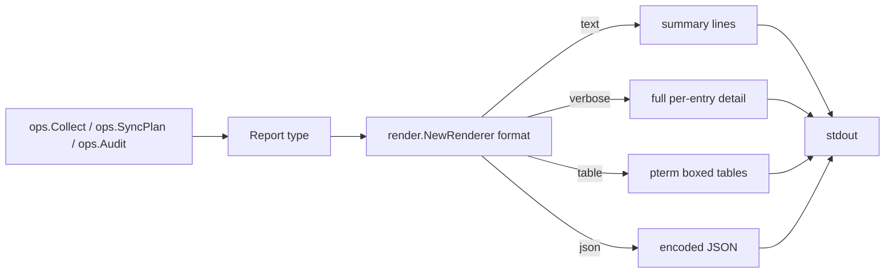

# `internal/engine/render`

> Pure rendering layer. No dependencies on the manager packages — the
> renderers consume the report types and serialise to text / table /
> JSON.

## Public API

| Symbol | Description |
|--------|-------------|
| `OutputFormat` | `text`, `table`, `json`, `verbose` |
| `Renderer` | `interface{ Render(io.Writer, *StatusReport) error }` |
| `NewRenderer(format)` | Construct |
| Report types | `StatusReport`, `RepoEntry`, `SkillEntry`, `MCPEntry`, `AgentEntry`, `AuditReport`, `PlanReport` |
| Status codes | `StatusOK`, `StatusDirty`, `StatusNotCloned`, `StatusPartial`, `StatusPresent`, `StatusAbsent`, `StatusUnmanaged`, `StatusError` |
| `RenderSyncBrief(w, plan, status, dur) error` | Default one-line summary after `gaal sync` |
| `RenderSyncSummary(w, plan, status, dur) error` | `--verbose` summary used after `gaal sync --verbose` |
| `WriteTip(w)` | Optional footer hint printed on TTY |

## File layout

| File | Contents |
|------|----------|
| `report.go` | All report types and status code constants |
| `renderer.go` | `OutputFormat`, `Renderer` interface, `NewRenderer()` |
| `json.go` | `jsonRenderer` — indented JSON encoder |
| `table.go` | `tableRenderer` — adaptive `pterm` tables |
| `audit.go` | `AuditRenderer`, JSON + table variants |
| `summary_sync.go` | `RenderSyncBrief`, `RenderSyncSummary` |

## Flow

## Why pure?

`render` has zero dependencies on `repo`, `skill`, `mcp`, or `discover`
— it only consumes the data structures defined in `report.go`. This
keeps the renderer reusable from `cmd` (for the post-sync brief), from
`ops` (for status / audit / plan), and from tests (which can build a
report struct directly without standing up managers).

## Sync summary modes

| Mode | When | Format |
|------|------|--------|
| `RenderSyncBrief` | `gaal sync` (default) | Single line per resource type with counts |
| `RenderSyncSummary` | `gaal sync --verbose` | Per-resource lines with detected drift, install targets, durations |

Both render the **planner's** verb (cloned / installed / upserted) for
each managed resource, paired with the **post-sync state** from
`ops.Collect`.

## Recent fixes worth knowing

| PR | Issue | Effect |
|----|-------|--------|
| #189 | #127 | `summary_sync.go` correctly counts MCP servers per agent in the rollup line |

## Related

- [`packages/engine.md`](engine.md), [`packages/engine-ops.md`](engine-ops.md) — producers of the report types
- [`commands/sync.md`](../commands/sync.md) — main consumer of `RenderSyncBrief` / `RenderSyncSummary`
