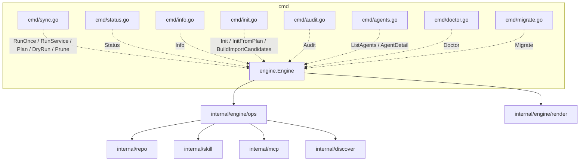
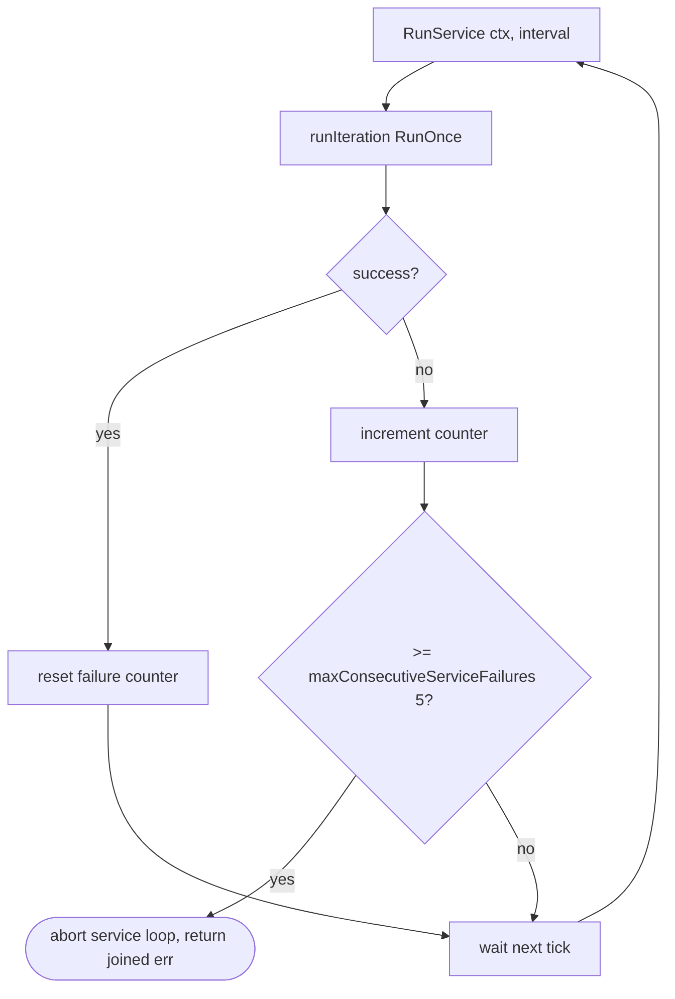

# `internal/engine`

> The single coupling point between `cmd/` and the three resource
> managers (`repo`, `skill`, `mcp`). Holds no business logic of its own
> — every command operation delegates to `engine/ops`, every rendering
> concern to `engine/render`.

## Public API

| Symbol | Description |
|--------|-------------|
| `New(cfg) *Engine` | Construct with default directories |
| `NewWithOptions(cfg, Options) *Engine` | Construct with overrides |
| `Options` | `WorkDir`, `StateDir`, `Force`, `Verbose` |
| `Engine.RunOnce(ctx) error` | One-shot sync (repos → skills → mcps) |
| `Engine.RunService(ctx, interval) error` | Service-mode loop |
| `Engine.Plan(ctx) (*PlanReport, error)` | Compute sync plan without writes |
| `Engine.DryRun(ctx, format) (*PlanReport, error)` | Plan + render |
| `Engine.Prune(ctx) error` | Skill + MCP prune (gated per #199 / #142) |
| `Engine.Collect(ctx) (*StatusReport, error)` | Read-only snapshot of resource state |
| `Engine.Status(ctx, format) error` | Render status to stdout |
| `Engine.Audit(ctx, format) error` | Render config-independent inventory |
| `Engine.Info(ctx, pkg, filter, format) error` | Render per-entry detail |
| `Engine.ListAgents() / AgentDetail(name)` | Agent registry queries |
| `Engine.Init(dest, force) error` | Bootstrap a `gaal.yaml` skeleton |
| `Engine.BuildImportCandidates(ctx, scope) (Candidates, error)` | FS scan for `init --import` |
| `Engine.InitFromPlan(dest, plan, force) error` | Import-mode write |
| `Engine.Migrate(target, url, dryRun) (*MigrateResult, error)` | (Stub) migration |
| `Engine.Doctor(opts) *DoctorReport` | Configuration health checks |

Type aliases re-export `engine/render` types (`OutputFormat`,
`StatusCode`, `RepoEntry`, `SkillEntry`, …) for backward compatibility
with `cmd/` callers.

## Architecture

## Why this shape?

1. `cmd/*.go` files import **only** `internal/engine`. Adding a new
   sub-command requires zero plumbing changes inside the managers.
2. `engine.Engine` owns the three managers and the resolved directories
   (`home`, `workDir`, `cacheRoot`, `stateDir`). Every operation that
   needs them goes through here.
3. Business logic (collect / plan / install / etc.) lives under
   `engine/ops` so it can be unit-tested without standing up Cobra.
4. Rendering lives under `engine/render` so the same data can be
   serialised to text / table / JSON without touching the managers.

## Service-mode failure cap (PR #201 / #134)

Prevents a wedged config from filling logs forever — successful
iterations reset the counter so transient errors don't accumulate.

## Cancellation (PR #200 / #126)

`runSync` (in `cmd/sync.go`) calls `checkInterrupted(ctx)` after each
phase (Plan / RunOnce / Prune). On Ctrl-C the engine's goroutines unwind
and the command returns `&ExitCodeError{Code: 130}` so
`PersistentPostRunE` still runs (telemetry flush + consent persist).

## Related

- [`packages/engine-ops.md`](engine-ops.md) — per-command operation logic
- [`packages/engine-render.md`](engine-render.md) — output types and
  renderers
- [`packages/repo.md`](repo.md), [`packages/skill.md`](skill.md), [`packages/mcp.md`](mcp.md) — managers driven by engine
