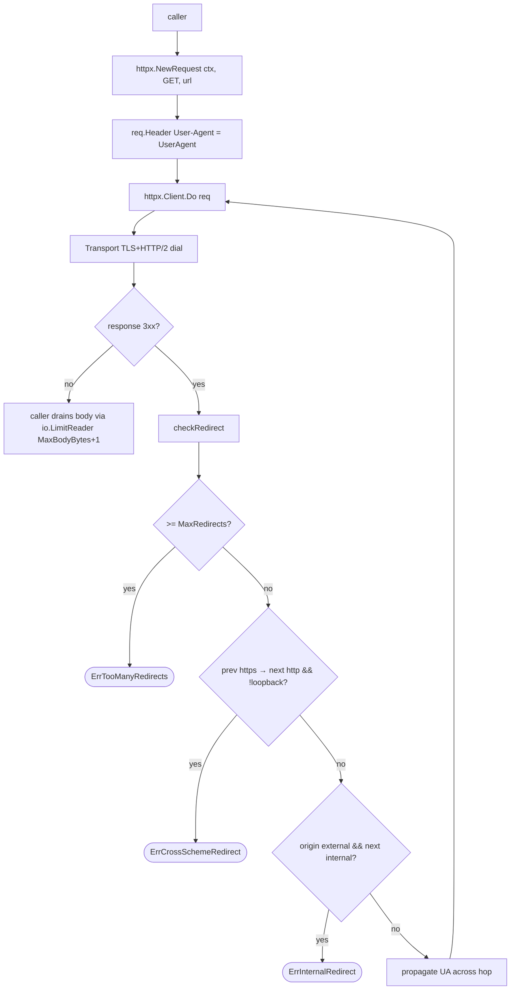

# `internal/httpx`

> Single hardened outbound HTTP client. Centralises TLS, timeout,
> redirect SSRF defence, body cap, and User-Agent so stray
> `http.DefaultClient` calls cannot regress the security posture.

Introduced in PR #205 (#123) as the consolidation of two ad-hoc call
sites: `internal/mcp` (remote MCP config fetch) and
`internal/core/vcs/archive.go` (archive download).

## Public API

| Symbol | Description |
|--------|-------------|
| `Client() *http.Client` | Shared client with the hardened defaults |
| `NewRequest(ctx, method, url) (*http.Request, error)` | Wraps `http.NewRequestWithContext` and sets the `User-Agent` header |
| `SetUserAgent(string)` | Mutates the package-level UA (called from `cmd/version.go init` to inject `gaal/<Version>`) |
| `UserAgent() string` | Reads the current UA |
| `MaxBodyBytes int64 = 16 << 20` | Recommended cap for ad-hoc JSON / text fetches; callers wrap `resp.Body` in `io.LimitReader(MaxBodyBytes+1)` |
| `DefaultClientTimeout = 5 * time.Minute` | Per-request hard cap |
| `MaxRedirects = 10` | Redirect cap |
| `ErrCrossSchemeRedirect`, `ErrTooManyRedirects`, `ErrInternalRedirect` | Redirect-policy errors surfaced verbatim from `Client.Do` |

## Defaults

| Concern | Default |
|---------|---------|
| `Client.Timeout` | `5m` (callers can tighten via context) |
| `Transport.TLSClientConfig.MinVersion` | `tls.VersionTLS12` |
| `Transport.TLSHandshakeTimeout` | `10s` |
| `Transport.DialContext` | `30s` connect, `30s` keepalive |
| `Transport.ExpectContinueTimeout` | `1s` |
| `Transport.ForceAttemptHTTP2` | `true` |
| Proxy | `http.ProxyFromEnvironment` |
| Redirect cap | 10 hops |
| https → http downgrade redirect | rejected unless target is loopback |
| External → internal/loopback redirect | rejected (SSRF defence) |
| User-Agent | `gaal/<Version>` (set by `cmd init`) |

## Flow

## Why caller-side body cap?

Body-size enforcement lives at the caller because:

- The MCP JSON path is small and uses `httpx.MaxBodyBytes` (16 MiB) —
  more than enough headroom.
- The archive download path streams large payloads (up to 1 GiB by
  policy) and has its own per-entry caps inside the tar/zip extractor
  ([`packages/core-vcs.md`](core-vcs.md)).

A single shared cap inside the client would either OOM-protect at the
wrong size or break legitimate large fetches. Caller-side caps stay
explicit at the use site.

## Tests

`httpx_test.go` covers:

- UA default + `SetUserAgent` mutation
- UA propagation through `NewRequest`
- Context-timeout takes precedence over `Client.Timeout`
- Redirect cap fires
- `isLoopback` and `isInternal` classifiers (RFC1918, link-local,
  IMDS at 169.254.169.254, etc.)

## Related

- [`packages/urlx.md`](urlx.md) — pre-fetch URL validation
- [`commands/sync.md`](../commands/sync.md) — main consumer
