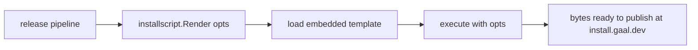

# `internal/installscript`

> Renders the `curl | sh` installer payload that the gaal landing
> page serves. Pure Go templating; no I/O.

## Public API

| Symbol | Description |
|--------|-------------|
| `Render(opts Options) ([]byte, error)` | Generate the install script for a given OS / arch / version |
| `Options` | Inputs: target OS, arch, version, optional checksum |

## Why it lives in `internal`

The install script is the **only** artefact gaal produces aside from
its binary, so its content is part of the supply chain. Keeping it as
a Go package (rather than a static asset) means:

- The version string and download URLs are typed values, not regex
  substitutions.
- Tests can render the script and execute snippets in a sandbox.
- The release pipeline can call `Render` directly without re-implementing
  the URL scheme.

## Flow

## Tests

Cover OS/arch coverage, version interpolation, and (by snapshotting the
output) protect against accidental edits to the canonical install
flow.

## Related

- `cmd/version.go` — same `Version` constant referenced in the rendered
  script.
