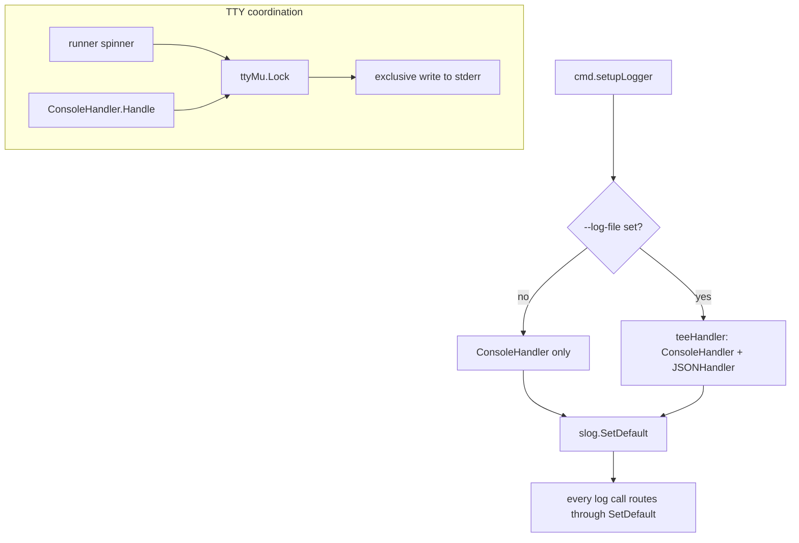

# `internal/logger`

> Console + JSON file slog handlers. One TTY mutex coordinates the
> spinner and console output so they never interleave.

## Public API

| Symbol | Description |
|--------|-------------|
| `New(opts Options) *slog.Logger` | Build a logger with the requested handlers |
| `Options` | `Level`, `LogFile`, `NoColor` |
| `ConsoleHandler` | Compact, ANSI-coloured stderr handler with TTY auto-detection |
| `teeHandler` | Fan-out to multiple handlers (used when `--log-file` is set) |
| `ttyMu *sync.Mutex` | Shared with the runner spinner to prevent line interleave |

## Handlers

| Handler | Destination | Format |
|---------|-------------|--------|
| `ConsoleHandler` | `stderr` | Compact, colourised (ANSI), TTY-aware |
| `slog.JSONHandler` | file (`--log-file`) | JSON Lines with `host` and `time` fields |

The log file is written via `secfile.OpenAppend` so it lands `0o600`
(see [`packages/secfile.md`](secfile.md)).

## Flow

## Why a shared mutex?

Without coordination, a slog `Info` call landing while the pterm
spinner is mid-tick would clobber the spinner's carriage-return-based
animation, leaving stray tty escape sequences in the user's terminal.
The shared `ttyMu` is acquired by both writers so they take turns.

## Related

- [`packages/runner.md`](runner.md) — the spinner side of the mutex
- [`packages/secfile.md`](secfile.md) — log file permission
