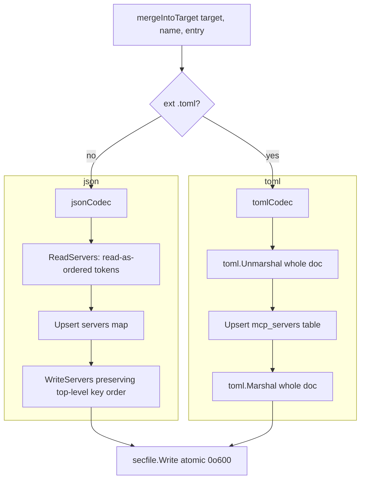

# `internal/mcp`

> MCP entry upsert. Reads / writes JSON or TOML agent configuration
> files preserving every key the user owns; handles inline and remote
> sources.

## Public API

| Symbol | Description |
|--------|-------------|
| `NewManager(mcps []ConfigMcp, home, stateDir string) *Manager` | Construct |
| `Manager.Sync(ctx) error` | Upsert every entry into its target file |
| `Manager.Prune(ctx) error` | Remove entries no longer in config (gated per-target by `prune: true`) |
| `Manager.Status(ctx) []Status` | Per-entry `{Name, Target, Present, Dirty, Err}` |

## Source modes

| Mode | Description |
|------|-------------|
| `inline:` | Full server definition in YAML (stdio `command`/`args`/`env`, or HTTP `type`/`url`/`headers`) |
| `source:` | Remote URL returning a JSON document (full `mcpServers` map or a single entry) |

Validated via [`packages/urlx.md`](urlx.md) before any HTTP call.

## Codec selection



## Order-preserving JSON codec (PR #203 / #122)

The Codex agent's `~/.codex/config.toml` carries unrelated keys
alongside `mcp_servers` (`model`, `sandbox`, `[analytics]`…) that must
survive a round-trip — that's a regular concern in JSON-based agents
too where `claude_desktop` adds `feature_flags`, `default_model`, etc.

`jsonCodec` walks the top-level object via `json.Decoder.Token()` so
key order is preserved exactly. Only the `mcpServers` block is
rewritten; every other key is emitted verbatim.

## Atomic write (PR #202 / #120)

Every codec ends in `secfile.Write(path, bytes)` — temp file →
fsync → rename → chmod 0o600. See [`packages/secfile.md`](secfile.md).

## Remote source fetch (PR #205 / #123)

Remote `source:` URLs go through [`packages/httpx.md`](httpx.md):

- `urlx.ValidateRemoteFetchURL` — scheme allowlist
- `httpx.Client` — TLS 1.2 minimum, redirect SSRF defence, 5-min
  timeout
- `io.LimitReader(resp.Body, MaxBodyBytes+1)` — 16 MiB cap on the JSON
  response

## Target resolution

```mermaid
flowchart LR
    A[ConfigMcp] --> B{target field set?}
    B -- yes --> C[deprecated: use as-is, warn]
    B -- no --> D[expand agents + global → per-agent target]
    D --> D1{agents == ['*']?}
    D1 -- yes --> D2[agent.Names]
    D1 -- no --> D3[explicit list]
    D2 --> E[for each agent: ProjectMCPConfigPath or GlobalMCPConfigPath]
    D3 --> E
```

## Prune opt-in (PR #199 / #142)

`Manager.Prune` deletes entries from a target file only when at least
one config entry pointing at that target carries `prune: true`. This
prevents `gaal sync --prune` from wiping manually-curated entries the
user never told gaal to manage.

## Tests

`manager_test.go` covers:

- inline and remote source modes
- JSON and TOML codec round-trip with extra keys preserved
- prune opt-in behaviour (with and without `prune: true`)
- snapshot writes
- legacy `target:` warning

## Related

- [`packages/secfile.md`](secfile.md), [`packages/urlx.md`](urlx.md),
  [`packages/httpx.md`](httpx.md) — write + fetch primitives
- [`packages/core-agent.md`](core-agent.md) — target path resolution
- [`commands/sync.md`](../commands/sync.md#3--mcpmanagersync-sequential-per-entry) — high-level flow
