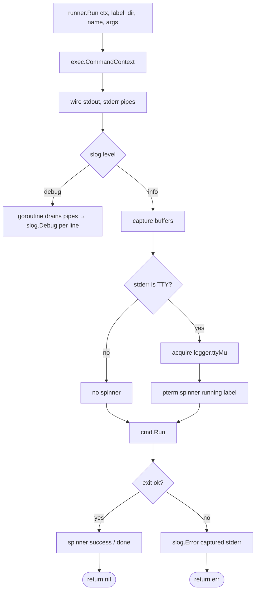

# `internal/runner`

> Subprocess execution adapter. Maps `os/exec` output to the active
> log level and runs a TTY spinner when stderr is interactive.

## Public API

| Symbol | Description |
|--------|-------------|
| `Run(ctx, label, dir, name string, args ...string) error` | Execute `name args...` in `dir`; show a spinner while running on a TTY |

## Behaviour by log level

| Level | Behaviour |
|-------|-----------|
| `DEBUG` (`--verbose`) | stdout + stderr logged line-by-line via `slog.Debug`; no spinner |
| `INFO` (default) | output captured silently; spinner ticks; on failure stderr is emitted via `slog.Error` |

## Flow

## Why coordinate with the logger?

A `slog` call landing mid-spinner would corrupt the carriage-return
animation. `runner` and `logger` share `ttyMu` so only one writer
touches stderr at a time. See [`packages/logger.md`](logger.md).

## Consumers

| Caller | Use |
|--------|-----|
| `internal/core/vcs/hg.go`, `svn.go`, `bzr.go` | Wrap subprocess calls to those VCS binaries |

## Tests

`runner_test.go` covers:

- Successful exit with INFO and DEBUG levels (no goroutine leaks)
- Failure with stderr emission
- Context cancellation propagation
- Spinner mutex acquisition (with a stub TTY)

## Related

- [`packages/logger.md`](logger.md) — the other half of `ttyMu`
- [`packages/core-vcs.md`](core-vcs.md) — every subprocess VCS backend
  goes through `runner`
