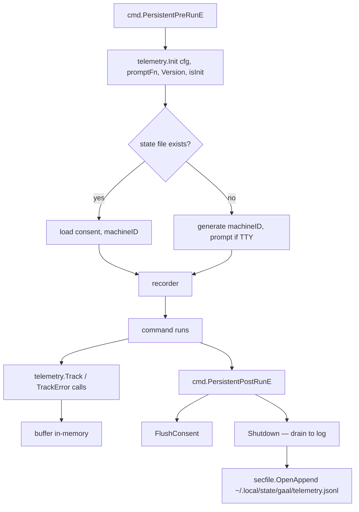

# `internal/telemetry`

> Anonymous usage telemetry. Consent-gated, append-only, batched on
> shutdown.

## Public API

| Symbol | Description |
|--------|-------------|
| `Init(cfg, promptFn, version, isInit) (*Telemetry, error)` | Reads consent state, prompts on first run, returns the active recorder |
| `Track(event string)` | Record a named event (no payload) |
| `TrackError(event string, err error)` | Record a typed error event; the error is normalised to a class — never the raw message — to prevent path / URL leakage (PR for #111) |
| `TrackFirstSync(durationMillis int64)` | Specialised event for the first successful sync after `gaal init` |
| `Custom(key, value string)` | Attach a free-form annotation to the current invocation |
| `FlushConsent()` | Persist updated consent state (called by `PersistentPostRunE`) |
| `Shutdown()` | Drain pending events to the on-disk log |

## Consent model

Telemetry is opt-in:

| State | Behaviour |
|-------|-----------|
| `telemetry: true` (global or user config) | Every event recorded |
| `telemetry: false` | Recorder is a no-op |
| Unset on first run | TTY-aware prompt; non-TTY defaults to **off** |

The `telemetry` key carries `gaal:"maxscope=user"`: a workspace
`gaal.yaml` cannot silently re-enable telemetry if the user has opted
out at the user / global level. See [`docs/config.md`](../config.md#scope-restriction-policy).

## Flow

## On-disk layout

| File | Purpose | Permission |
|------|---------|-----------|
| `~/.local/state/gaal/telemetry.json` | Consent state + machine ID | 0o600 (`secfile.Write`) |
| `~/.local/state/gaal/telemetry.jsonl` | Append-only event log | 0o600 (`secfile.OpenAppend`) |

In `--sandbox` mode both paths resolve under the sandbox root.

## Why never `err.Error()`?

`TrackError` deliberately discards the error message and records only
the **class** (e.g. `git.clone.auth_required`, `mcp.parse_error`). Raw
error messages frequently include URLs, file paths, or token fragments
that the user has not consented to sharing. PR for #111 made this the
default behaviour everywhere.

## Why post-run flush?

`PersistentPostRunE` runs even when `RunE` returns an error wrapped in
`cmd.ExitCodeError{Code, Cause}`. This gives consent persistence and
event flush a guaranteed exit path — fixes #109 (where `os.Exit` in
several commands skipped post-run hooks entirely).

## Tests

- Consent prompt behaviour (TTY vs. non-TTY)
- maxscope policy enforcement
- `TrackError` strips raw message, keeps class
- Round-trip read / write of state

## Related

- [`packages/secfile.md`](secfile.md) — atomic writes for the state
  and log files
- [`docs/config.md`](../config.md#scope-restriction-policy) — scope
  policy that protects the consent decision
