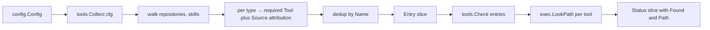

# `internal/tools`

> External-tool PATH probe. Sources declare which binaries they
> require; `tools.Check` looks each one up so `gaal sync` can warn
> early and `gaal doctor` can fail loud.

## Public API

| Symbol | Description |
|--------|-------------|
| `Tool struct{ Name, Hint string }` | One required binary; `Hint` is the install suggestion shown to the user |
| `Entry struct{ Tool Tool; Source string }` | Binary attributed back to the config source that needs it |
| `Status struct{ Entry Entry; Found bool; Path string }` | One row in the probe result |
| `Collect(cfg *config.Config) []Entry` | Walk the config and gather the deduplicated tool list |
| `Check(entries []Entry) []Status` | `exec.LookPath` each tool, return statuses |

## What declares a tool?

| Source | Tools |
|--------|-------|
| `repositories` of type `hg` / `svn` / `bzr` | `hg` / `svn` (+ `svnversion`) / `bzr` |
| `skills` with non-git VCS sources | the corresponding VCS binary |
| MCP entries with `command:` fields | _not_ collected (those run as agent subprocesses, not gaal subprocesses) |

The `tar` and `zip` types use the Go standard library — no external
binary required.

## Flow

## Consumers

| Caller | Use |
|--------|-----|
| `cmd/sync.go::warnMissingTools` | One-line stderr banner before sync runs (never blocks) |
| `cmd/doctor.go` (via `ops.RunDoctor.checkTools`) | Authoritative health check; missing-tool with no fallback → exit 2 |

## Why never block sync?

The probe is heuristic — a user might have installed a tool to a
non-standard PATH that `gaal` is invoked with. Hard-failing sync at the
probe stage would be a false positive that the per-entry failure (when
the binary actually fails to run) would have caught anyway.

`gaal doctor` is the authoritative health check: it runs the same
probe but treats missing tools as actionable findings (exit 1
warnings, exit 2 errors when no fallback exists).

## Related

- [`commands/doctor.md`](../commands/doctor.md) — full doctor flow
- [`commands/sync.md`](../commands/sync.md#tooling-probe) — banner placement
